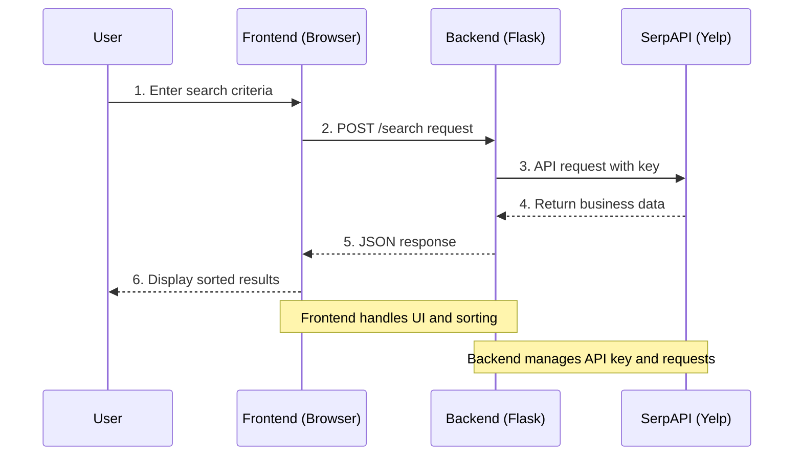

# Yelp Search Application Architecture

This document explains how our Yelp search application works, breaking down the interaction between the frontend (what you see in the browser) and the backend (the server that processes requests).

## Overview

Our application is like a restaurant where:
- The frontend is like the dining room where customers (users) interact
- The backend is like the kitchen where the actual work happens
- The API (SerpAPI) is like a food delivery service that brings us the data we need

## System Architecture



This sequence diagram shows:
1. The clear flow of data between components
2. The role of each component in the process
3. How the API key is kept secure in the backend
4. The separation of concerns between frontend and backend

## Frontend (What You See)

### HTML (index.html)
Think of HTML as the structure of a house. In our case, it creates:
- A search box for the location
- A search box for what you're looking for
- A search button
- A space to show results

```html
<div class="search-form">
    <input type="text" id="location" ...>
    <input type="text" id="searchTerm" ...>
    <button onclick="searchBusinesses()">Search</button>
</div>
```

### CSS (styles.css)
CSS is like the interior design of our house. It makes everything look nice by:
- Setting colors (like Yelp's red)
- Arranging elements on the page
- Making the interface responsive (works on phones and computers)
- Styling the business cards and ratings

### JavaScript (script.js)
JavaScript is like the waiter in our restaurant. It:
1. Listens for when you click the search button
2. Collects what you typed in the search boxes
3. Sends this information to the backend
4. Shows a loading message while waiting
5. Receives the results and displays them nicely

```javascript
async function searchBusinesses() {
    // 1. Get what the user typed
    const location = document.getElementById('location').value;
    
    // 2. Send to backend
    const response = await fetch('/search', {
        method: 'POST',
        body: JSON.stringify({
            location: location,
            searchTerm: searchTerm
        })
    });
    
    // 3. Show results
    const data = await response.json();
    // ... display results ...
}
```

## Backend (The Server)

### Python with Flask (app.py)
Flask is our server framework - think of it as the kitchen in our restaurant. It:
1. Serves the frontend files (HTML, CSS, JavaScript)
2. Handles search requests
3. Communicates with SerpAPI
4. Returns results to the frontend

```python
@app.route('/search', methods=['POST'])
def search():
    # 1. Get the search request
    data = request.json
    location = data.get('location')
    
    # 2. Prepare the search
    params = {
        "api_key": os.getenv("SERPAPI_API_KEY"),
        "engine": "yelp",
        "find_loc": location,
        "find_desc": search_term
    }
    
    # 3. Get results from SerpAPI
    search = GoogleSearch(params)
    results = search.get_dict()
    
    # 4. Send back to frontend
    return jsonify(results)
```

## How They Work Together

1. **User Interaction**:
   - You type a location and search term
   - You click the search button

2. **Frontend to Backend**:
   - JavaScript collects your input
   - Sends it to the backend using `fetch`
   - Shows a loading message

3. **Backend Processing**:
   - Flask receives the request
   - Gets your API key from environment variables
   - Sends request to SerpAPI
   - Waits for results

4. **Backend to Frontend**:
   - Flask sends results back to JavaScript
   - JavaScript sorts results by rating
   - Creates HTML for each business
   - Updates the page with results

## Data Flow

```
User → Frontend (HTML/CSS/JS) → Backend (Flask) → SerpAPI
     ↑                                                      |
     └──────────────────────────────────────────────────────┘
```

## Key Concepts

1. **Client-Server Model**:
   - Frontend (client) makes requests
   - Backend (server) processes them
   - Like a customer (client) ordering from a restaurant (server)

2. **API (Application Programming Interface)**:
   - SerpAPI is a service that provides data
   - Like a food delivery service for data

3. **Asynchronous Programming**:
   - JavaScript uses `async/await` to wait for results
   - Like a waiter who can serve multiple tables

4. **Environment Variables**:
   - Store sensitive data (like API keys) securely
   - Like a secret recipe kept in a safe

## Security Considerations

1. **API Key Protection**:
   - Stored in `.env` file
   - Never sent to frontend
   - Like keeping the restaurant's secret recipes safe

2. **Error Handling**:
   - Both frontend and backend handle errors
   - Shows user-friendly messages
   - Like a restaurant having a plan for when things go wrong

## Running the Application

1. Start the backend:
```bash
python app.py
```

2. Open in browser:
```
http://localhost:5000
```

The application will be ready to search for businesses on Yelp! 